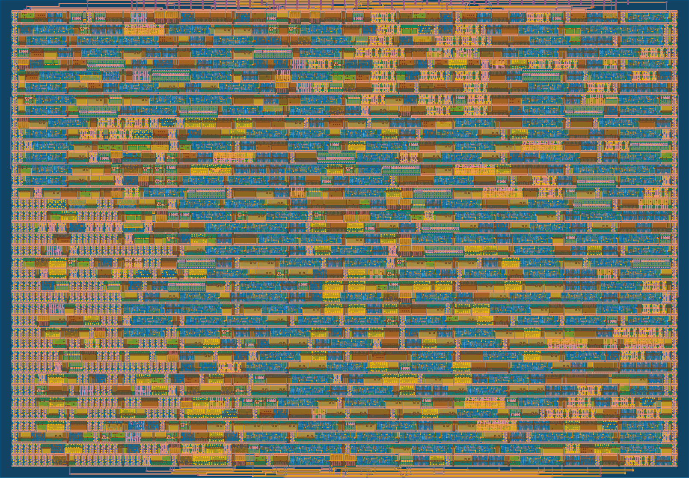
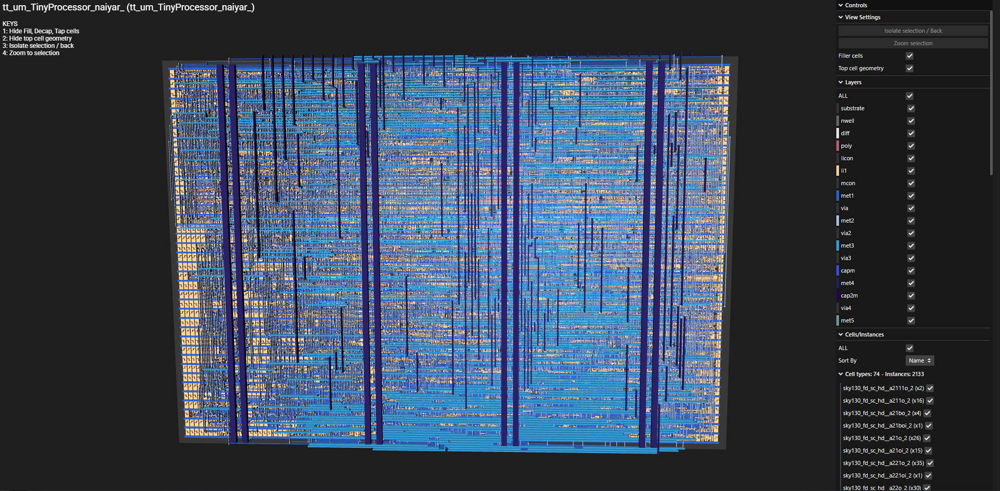
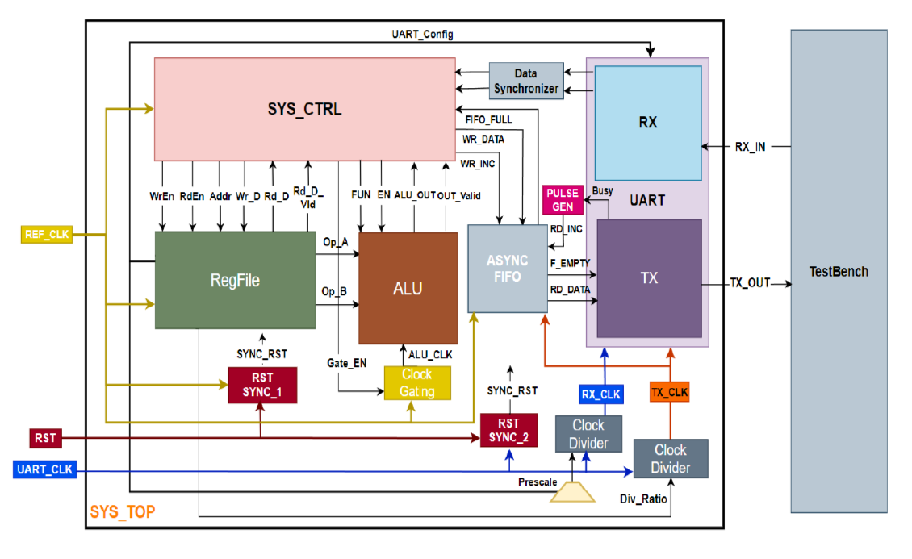

<!---

This file is used to generate your project datasheet. Please fill in the information below and delete any unused
sections.

You can also include images in this folder and reference them in the markdown. Each image must be less than
512 kb in size, and the combined size of all images must be less than 1 MB.
-->

# TinyProcessor

## Overview

TinyProcessor is a compact UART-controlled processor designed in Verilog and implemented as an ASIC using the Tiny Tapeout open-source design flow. The processor executes a small instruction set through serial communication, allowing a host computer or microcontroller to control memory operations and arithmetic functions using UART commands.

The project was built to demonstrate the complete digital IC design workflow:

RTL design -> Verification -> synthesis -> place-and-route -> physical implementation on silicon.

## Features

- 50MHz System Clock

- 3.125MHz UART Clock (96000 Baud Rate)

- UART-controlled instruction interface

- 8x8 bit register file

- Arithmetic Logic Unit (ALU):
  - Addition
  - Subtraction
  - XOR
  - NOR
  - AND
  - OR
  - NAND
  - XNOR
  - Equal to
  - Less than
  - Greater than
  - Shift Right by 1 bit
  - Shift Left by 1 bit

- Four supported processor commands: - Read Register - Write Register - ALU Operation with User Given Operands - ALU Operation with Present Register Memory

- Configurable UART baud-rate prescaler

- UART parity enable and parity type configuration

- Clock division and clock gating

- Reset synchronization

- Fully verified using Verilog Test Bench, Cocotb and GTKWave

## Schematics and Visuals

Below is the Post-routing GDSII layout view of the custom digital ASIC design, showcasing standard cell placement, power ring/rail distribution, and multi-layer metal interconnect routing following physical design hardening and timing closure:

3D physical layout view of the custom TinyProcessor core implemented using the SkyWater 130nm PDK (sky130_fd_sc_hd). The visualization showcases the layered metal interconnects (met1–met5), standard cell placement, and vertical power straps rendered directly in the Tiny Tapeout 3D GDS viewer:

Below is the original Schematic

\*\* Note:

    - Tiny Tapeout only provides a single external clock, so we removed:
        - ❌ Asynchronous FIFO
        - ❌ Clock Domain Crossing (CDC) logic
        - ❌ data_sync
        - ❌ Separate UART clock domain

Everything now runs from the 50 MHz reference clock. \*\*

## How it works

The processor operates as a UART-controlled command execution engine, communicating with an external host through a standard UART interface configured for 1 start bit, 8 data bits, 1 parity bit, and 1 stop bit (8P1). Commands are transmitted as multi-frame UART packets, allowing the processor to receive complete instructions consisting of operation codes, register addresses, and data operands. These frames are decoded by the System Control FSM (SYS_CTRL), which coordinates register accesses and ALU operations before transmitting results or status information back to the host through the UART transmitter.

### 1. Unified Clock Architecture (REF_CLK)

Because the design is adapted for Tiny Tapeout, the entire chip operates on a single synchronous clock domain (REF_CLK). All modules, including the UART controller, FSM, and ALU, run synchronously off this master system clock.

- SYS_CTRL.v (System Controller): The primary FSM that decodes incoming commands from the UART receiver, orchestrates register file access, triggers the ALU, and dispatches output data to the UART transmitter.

- RegFile.v (Register File): An 8x8 storage bank used for data staging, holding operand values, and storing UART/Clock Divider configuration settings.

- ALU.v (Arithmetic Logic Unit): Executes 14 supported arithmetic, bitwise logical, comparison, and shift operations on Operands A and B.

- UART (RX / TX): Handles serial-to-parallel reception (RX) and parallel-to-serial transmission (TX) synchronously using baud rate generation derived directly from the main system clock.

- Clock Gating: Dynamically gates REF_CLK fed to the ALU via Gate_EN to minimize dynamic switching power when no ALU calculations are active.

- RST_SYNC: Synchronizes the active-low external reset line (RST) to the system clock.

### 2. Register Mapping & Configuration

| **Address** | **Register Name** | **Description & Default Settings**                                                |
| ----------- | ----------------- | --------------------------------------------------------------------------------- |
| 0x0         | REG0              | ALU operand A                                                                     |
| 0x1         | REG1              | ALU operand B                                                                     |
| 0x2         | REG2              | UART Config: Parity Enable (REG2[0]), Parity Type (REG2[1]), Prescale (REG2[7:2]) |
| 0x3         | REG3              | Clock Divider Ratio                                                               |
| 0x4-0x15    | REG4-REG15        | General-purpose storage for r/w operations                                        |

### 3. Command Protocol

The system utilizes four high-level UART packet formats parsed by the `SYS_CTRL` unit to execute memory and arithmetic commands:

| **Command Type**         | **Opcode** | **Frame Count** | **Frame Breakdown**                                                                             | **Description**                                                                                                                 |
| :----------------------- | :--------- | :-------------- | :---------------------------------------------------------------------------------------------- | :------------------------------------------------------------------------------------------------------------------------------ |
| **Register Write**       | `0xAA`     | 3 Frames        | `Frame 0: 0xAA` `Frame 1: Target Address` `Frame 2: Write Data`                           | Writes 8-bit data into the targeted Register File address.                                                                      |
| **Register Read**        | `0xBB`     | 2 Frames        | `Frame 0: 0xBB` `Frame 1: Target Address`                                                    | Reads 8-bit data from the specified register and transmits it back over `UART_TX`.                                              |
| **ALU Op with Operands** | `0xCC`     | 4 Frames        | `Frame 0: 0xCC` `Frame 1: Operand A` `Frame 2: Operand B` `Frame 3: ALU Function Code` | Updates `REG0` and `REG1` with new operands, executes the ALU operation, and streams the result back over `UART_TX`.            |
| **ALU Op (No Operands)** | `0xDD`     | 2 Frames        | `Frame 0: 0xDD` `Frame 1: ALU Function Code`                                                 | Executes the specified operation using existing operands stored in `REG0` and `REG1`, streaming the result back over `UART_TX`. |
